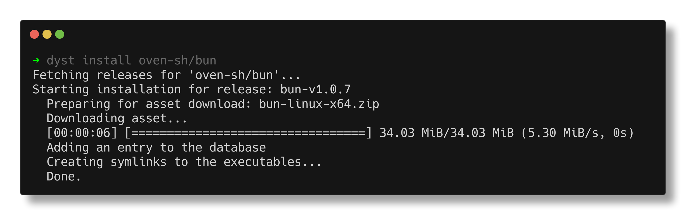

# dyst

A distilled package manager for pulling executable assets from GitHub releases.

_This program was designed as an alternative to [stew](https://github.com/marwanhawari/stew)._

## Features

- Automatically determines the asset based on the computer's architecture and operating system
- Extracts downloaded archives autonomously
- Define a rule to automatically rename the executable
- Update all binaries at once
- Assets are downloaded per-user



## Installation

```
# download the compiled binary
curl -s -L https://github.com/DISTREAT/dyst/releases/download/0.1.0/dyst-linux-x86_64.tar.gz | tar xzf - -C /tmp

# 'bootstrap' dyst by installing dyst using dyst
/tmp/dyst install DISTREAT/dyst -p
```

Download compiled binaries from the [release page](https://github.com/DISTREAT/dyst/releases).

## Usage

### Basic Installation

```
# dyst will automatically try to detect the asset needed
dyst install pnpm/pnpm

# install prereleases if available
dyst install DISTREAT/projavu -p
```

### Installing a specific asset

```
# get a list of all assets
dyst install jgm/pandoc -a

# install a specific asset
dyst install oven-sh/bun -f linux-aarch64
```

### Installing a specific tag

```
# install a specific tag
dyst install pnpm/pnpm -t v8.10.3

# lock the asset, preventing updates
dyst install DISTREAT/projavu -l -t 0.1.1
```

### Removing a repository

```
# list all installed repositories
dyst list

# remove all downloaded files
dyst remove pnpm/pnpm
```

### Renaming an executable

```
# list all executables
dyst list-execs oven-sh/bun

# rename an executable
dyst rename pnpm/pnpm pnpm-linux-x64/pnpm
```

### Updating assets

```
# update all downloaded assts
dyst update
```
